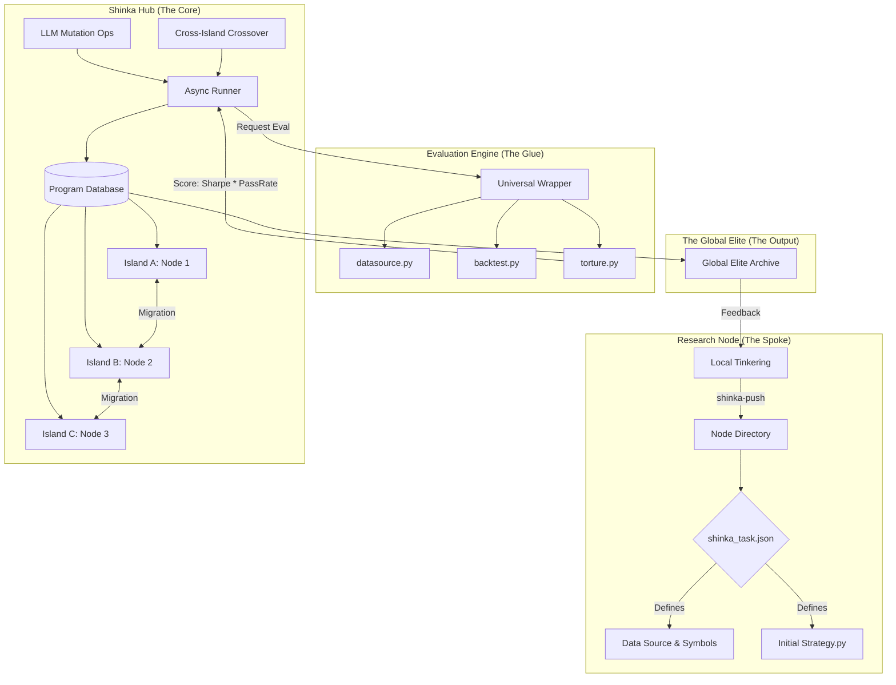

# Auto-Research Evolution Hub (AI Sandbox)

This architecture integrates **ShinkaEvolve** (Population-based Evolution) with **auto-research** (Serial Hill-Climbing & Strategy Verification) into a unified, collaborative research environment.

## 1. Core Architecture (The Hub-and-Spoke Model)

The system is designed to be **agnostic** to individual research methods. A "Node" (Spoke) can opt-in to the central Shinka "Hub" by providing a standardized set of artifacts.



## 2. The "Research Node" Contract

To opt-in, a researcher provides a folder with the following "Convention-over-Configuration" artifacts:

### `shinka_task.json` (The Metadata)
```json
{
  "node_id": "momentum_btc_1h",
  "data": {
    "source": "ducklake",
    "args": {"symbol": "BTC-USD", "timeframe": "1h"}
  },
  "constraints": {
    "max_drawdown": 0.20,
    "min_trades": 50
  }
}
```

### `initial.py` (The Seed)
Must contain a `def strategy(bars):` function wrapped in `EVOLVE-BLOCK-START` and `EVOLVE-BLOCK-END` tags.

## 3. The Universal Evaluator (The Glue)

The Hub hosts a Master Evaluator that avoids redundant logic across nodes:
1.  **Reads Metadata**: Parses `shinka_task.json` for data requirements.
2.  **Loads Data**: Calls `auto-research/datasource.py`.
3.  **Injects DNA**: Places the evolved `strategy.py` into the environment.
4.  **Runs Backtest/Torture**: Executes `auto-research/backtest.py` and `torture.py`.
5.  **Normalizes Scores**: Provides a unified `combined_score` (e.g., `Sharpe * PassRate`) for cross-node comparison.

## 4. AWS Scaffolding & Hosting

For a collaborative group (10+ people), the following AWS resources are required:

| Component | Service | Purpose |
| :--- | :--- | :--- |
| **The Brain** | ECS (Fargate) | Runs the `ShinkaEvolveRunner` orchestrator. |
| **The Muscle** | AWS Batch | Concurrent evaluation jobs (backtests/torture) on Spot EC2. |
| **The Memory** | EFS / S3 | Persistent `ProgramDatabase` and result artifacts. |
| **The Data** | S3 (DuckLake) | Shared S3 catalogs for data consistency across nodes. |
| **The Registry** | S3 Ingest | Bucket for researchers to "push" node artifacts (`shinka_task.json`). |
| **The Vision** | ALB + WebUI | Hosted Shinka WebUI behind OIDC/Auth. |

## 5. Bullshit Detection (The Pragmatic Guardrails)

*   **Dependency Hell**: Evaluations run in the node's specific `uv` virtualenv or a shared "Mega-Image" to prevent library mismatches.
*   **Context Fragmentation**: Strict `bars -> positions` signature is the "Common Law." Any data variety must be mapped to the `bars` dictionary.
*   **Scale Overload**: AWS Batch handles queueing and scaling, preventing Researcher A from starving Researcher B's evolution.
*   **Knowledge Transfer**: Shinka's multi-island "Migration" enables the Hub to cross-pollinate a BTC signal into an ETH strategy autonomously.

## 6. Implementation Plan

1.  **Scaffold Hub**: Containerize `ShinkaEvolve` + `auto-research`.
2.  **Universal Wrapper**: Build `shinka_aws_eval.py` for AWS Batch execution.
3.  **AWS Stack**: Terraform/CDK for ECS, Batch, S3, and IAM roles.
4.  **CLI Integration**: Add `uv run auto-research push` to the local CLI for S3 ingestion.
