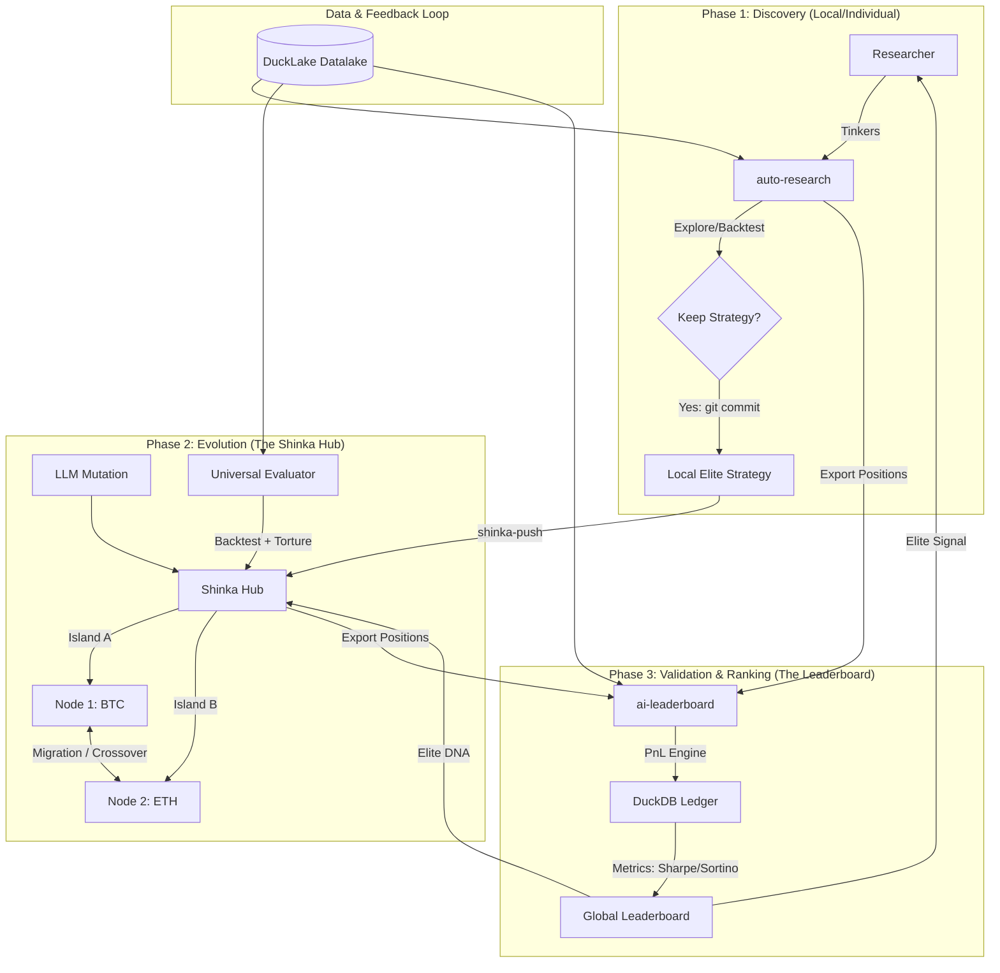

# The Auto-Research Evolution Ecosystem

This document outlines the unified architecture integrating **auto-research**, **ShinkaEvolve**, and **ai-leaderboard** into a collaborative, autonomous trading strategy discovery engine.

## 1. Unified Architecture Diagram

The ecosystem follows a **Discover → Evolve → Rank** pipeline, where each component serves a specialized role while maintaining a shared data contract.

## 2. Component Roles & Responsibilities

| Component | Responsibility | Key Technologies |
| :--- | :--- | :--- |
| **auto-research** | **The Lab**: Individual researchers explore data and build baseline strategies. | Python, Polars, Anthropic |
| **ShinkaEvolve** | **The Factory**: Evolves local strategies into robust populations via multi-island crossover. | Python, Asyncio, LLM Ensembles |
| **ai-leaderboard** | **The Judge**: Provides an objective "Ground Truth" by paper-trading all strategies. | Bun, TypeScript, DuckDB |

## 3. The Shared Data Contracts

To maintain the "Agnostic Node" philosophy, the systems communicate via standardized artifacts:

1.  **The Code Contract (`strategy.py`)**: All systems expect a `def strategy(bars):` function returning position weights.
2.  **The Data Contract (`bars`)**: A standardized dictionary of OHLCV arrays, sourced from the `DuckLake` datalake.
3.  **The Position Contract (`positions.json`)**: A ledger of `(date, instrument, weight)` tuples exported for the leaderboard.
4.  **The Metadata Contract (`shinka_task.json`)**: Defines the "Node Environment" (source, symbols, constraints).

## 4. Operational Workflow

1.  **Individual Research**: A researcher uses `auto-research` to find a "seed" strategy that survives torture testing.
2.  **Opt-in to Evolution**: The researcher pushes the node to the `Shinka Hub`. Shinka creates an island for this node.
3.  **Cross-Pollination**: Shinka’s evolution loop automatically "borrows" successful code snippets from other islands (e.g., a regime filter from an ETH island is applied to a BTC strategy).
4.  **Official Ranking**: The best evolved programs are exported to `ai-leaderboard`.
5.  **Global Alpha**: The community views the leaderboard to identify the most robust "Alpha" across all research threads.

## 5. Deployment Strategy (AWS)

*   **Hub**: ECS Fargate running the Shinka Runner.
*   **Scale**: AWS Batch running the parallel `auto-research` evaluators.
*   **Ledger**: `ai-leaderboard` hosted on App Runner/Fargate with a persistent DuckDB volume.
*   **Data**: Shared access to `s3://lynx-sandbox-agent-datalake/`.

---
*This ecosystem maximizes the creativity of individual researchers while leveraging the collective optimization power of automated evolution.*
